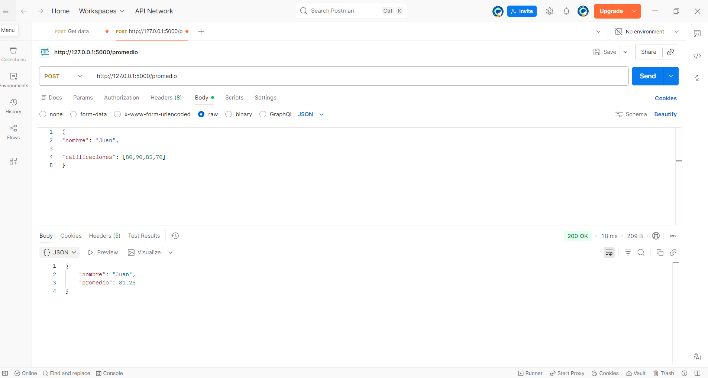
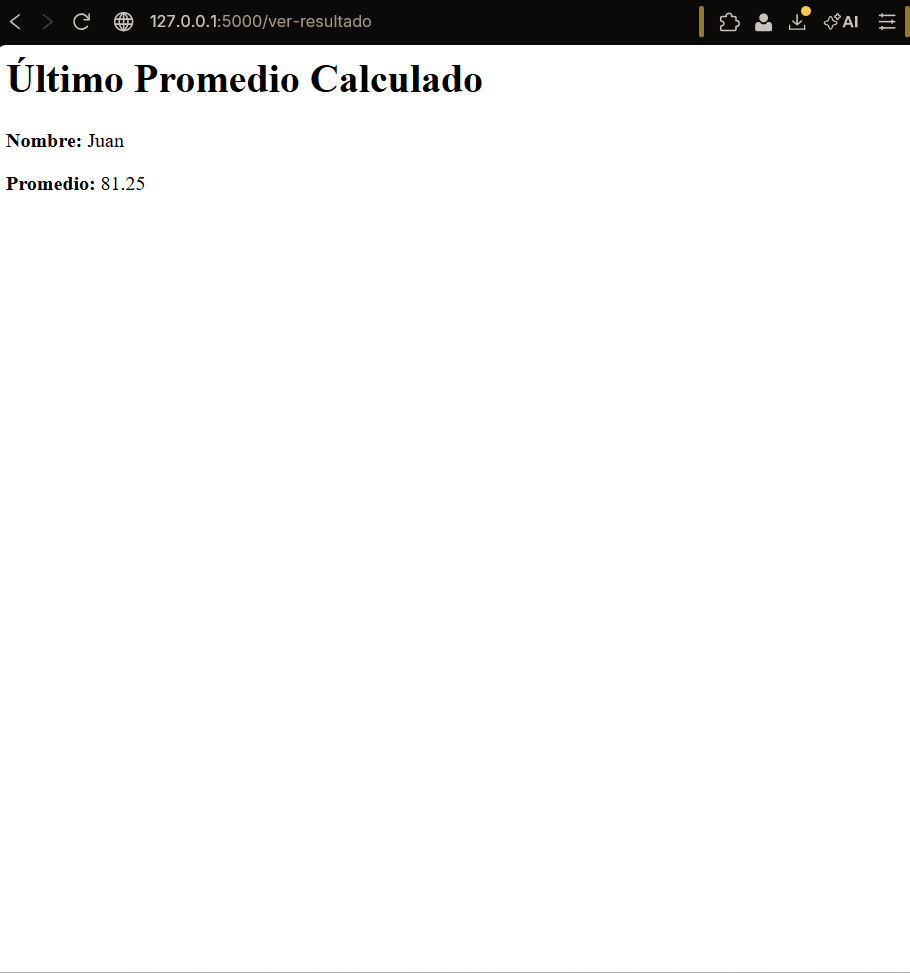

# API de Cálculo de Promedios con Flask

Este proyecto es una **API REST** desarrollada para la materia de **Desarrollo Web Orientado a Servicios** (5to Cuatrimestre). Permite procesar calificaciones enviadas mediante formato JSON y calcular el promedio de forma automática.

---

## Instalación y Configuración

Sigue estos pasos para ejecutar el proyecto localmente:

1. **Clonar el repositorio:**
   ```bash
   git clone [https://github.com/MrSilence0/Calcular_Promedios.git](https://github.com/MrSilence0/Calcular_Promedios.git)
   cd api_promedio
2. Activar el entorno virtual:
  ```bash
   # En Windows (PowerShell)
  .\venv\Scripts\activate
```
3.Instalar Flask:
  ```bash
  pip install flask
```
4.Ejecutar el servidor:
   ```bash
    python app.py
```
## Pruebas de Funcionamiento
Para probar la API, asegúrate de que el servidor esté corriendo en http://127.0.0.1:5000.

1. Petición POST con Postman
Envía un objeto JSON con el nombre del alumno y una lista de calificaciones a la ruta /promedio.

Ejemplo de JSON:
   ```bash
{
    "nombre": "Oswal",
    "calificaciones": [10, 9, 8, 10]
}
```



2. Visualización en el Navegador
Después de realizar la petición, puedes verificar el resultado visualmente en la ruta correspondiente del navegador.



## Estructura del Proyecto

```bash
api_promedio/
├── venv/                 # Entorno virtual (excluido en .gitignore)
├── images/               # Carpeta de recursos visuales
│   ├── Postman.png       # Captura de pantalla de la petición POST
│   └── Navegador.png     # Captura de pantalla del resultado
├── app.py                # Archivo principal con las rutas de Flask
└── README.md             # Documentación del proyecto
